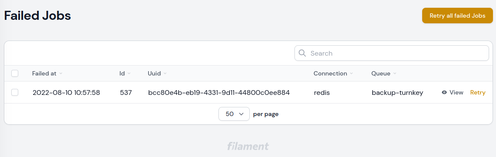
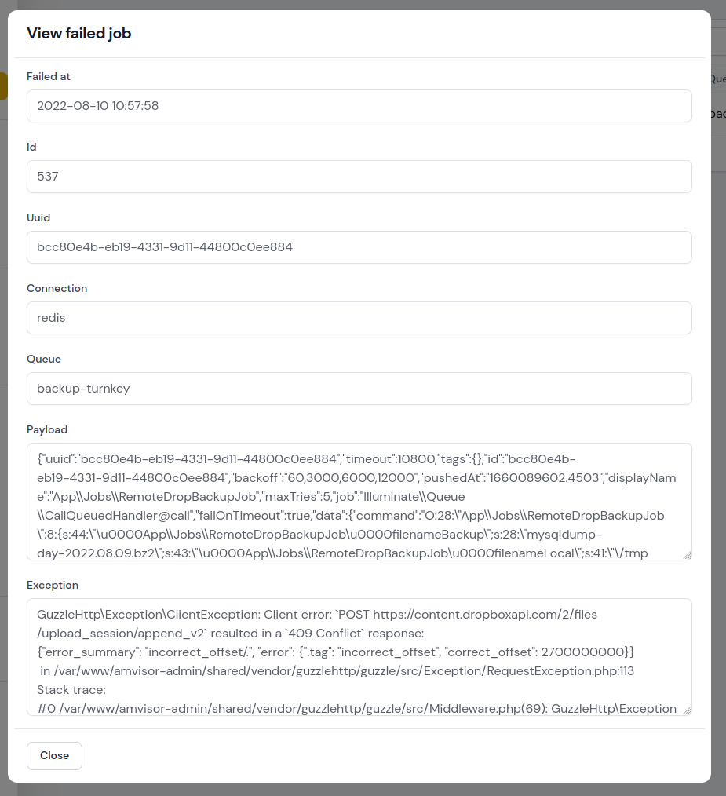

# A simple failed jobs viewer for your Filament apps.

This package provides a `Failed Jobs` resource that allows you to view your Failed jobs in a simple UI.




## Installation

You can install the package via Composer:

```bash
composer require yinsystems/filament-failed-jobs
```

You can publish the config file with:

[comment]: <> (```bash)

[comment]: <> (php artisan vendor:publish --tag="filament-failed-jobs-config")

[comment]: <> (```)

### Authorization

If you would like to prevent certain users from accessing your page, you should register an FailedJobsPolicy:

```php
use App\Policies\FailedJobPolicy;
use Amvisor\FilamentFailedJobs\Models\FailedJob;

class AuthServiceProvider extends ServiceProvider
{
	protected $policies = [
        FailedJob::class => FailedJobPolicy::class,
	];
}
```

```php
namespace App\Policies;

use App\Models\User;
use Illuminate\Auth\Access\HandlesAuthorization;

class FailedJobPolicy
{
	use HandlesAuthorization;

	public function viewAny(User $user): bool
	{
		return $user->can('manage_failed_jobs');
	}
}
```

This will prevent the navigation item from being registered.

## Changelog

Please see [CHANGELOG](CHANGELOG.md) for more information on what has changed recently.

## License

The MIT License (MIT). Please see [License File](LICENSE.md) for more information.
